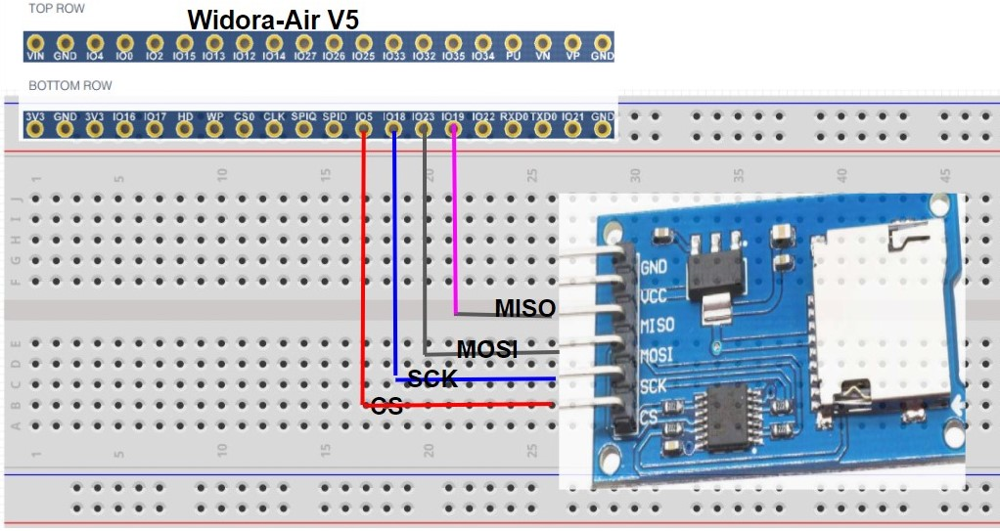
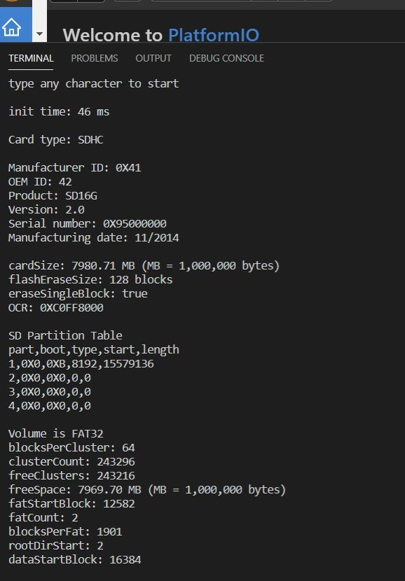
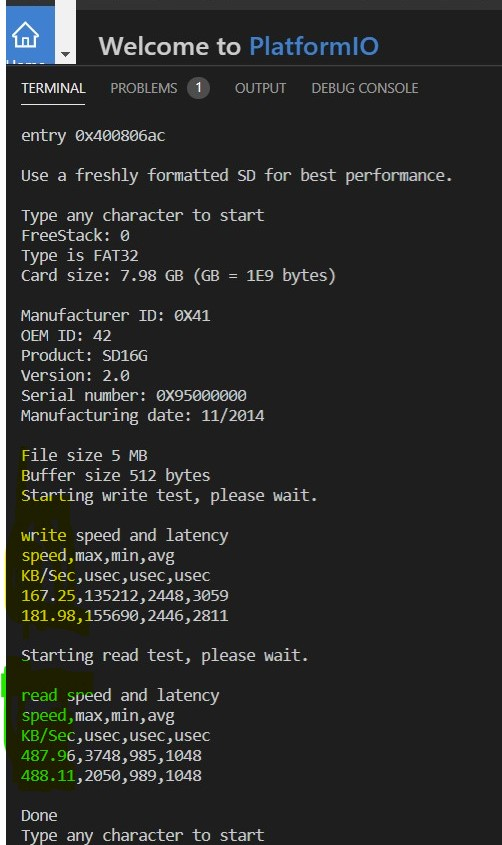

# ESP32-SPI   
Some SPI related notes...
 

### Wires to connect SPI SD/TF card  
Use ESP32's VSPI , works on Arduino SdFat library 
 &nbsp;&nbsp;&nbsp;  
 &nbsp;  
 
 - Change SPI pins in SdSpiDriver.h: _SPI.begin(18,19,23); //Change to VSPI_  
 - Change SPI Speed from 50MHz to 25MHz:  _if (!sd.cardBegin(SD_CHIP_SELECT, SD_SCK_MHZ(25))) {   //works under 25MHz_  

 
 

### References
  - [Arduino SdFat V2](https://github.com/greiman/SdFat) Arduino library SdFat.
